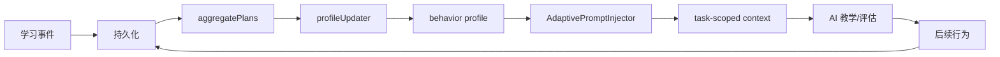

# 数据飞轮审计报告

> 适用版本：`v1.13.2`。最后复核：2026-07-27。
> 本次复核确认消费者边界与原审计一致；`v1.13.1` 的媒体查看、Mermaid、资源推荐及导航修复，以及 `v1.13.2` 的文档同步均未改变飞轮的数据语义。

## 结论摘要

系统已建立从学习事件 → 持久化 → 行为画像 → 安全 task-scoped Injector helper 的完整链路。数据产生层覆盖全部 9 种事件类型，规则/AI+behavior 画像已实现持久化闭环。

**目前 Detail（普通/SSE）与 Interactive start（普通/SSE）已接入个性化；其他消费者仍待后续批次。** 系统可证明数据用于个性化，但不能因果证明学习收益。

---

## 数据流

---

## 数据源矩阵

| 数据源 | 写入位置 | 飞轮刷新 | 上限 |
|---|---|---|---|
| Plan/Topic 完成度 | `plan.topics[].done` | ❌ | 无 |
| timeLog | `topic.timeLog[]` | ❌ | 无 |
| Exercise | `topic.exercises[]` | ✅ | 无 |
| Exam | `plan.examPapers[].results[]` | ✅ | 无 |
| Quick Quiz | `plan.quickQuizHistory[]` | ✅ | 20 条 |
| Q&A | `plan.history[]` | ✅ | 无 |
| Interactive mode | `topic.interactiveModeUsage` | ✅ | 无 |
| Feynman analysis | `topic.feynmanInsights` | ✅ | 无 |
| Generation feedback | `topic.generationFeedback[]` | 直接被 Detail context 消费 | 20 条 |

---

## Consumer 矩阵

| 消费者 | 状态 | 说明 |
|---|---|---|
| **Detail 生成** | ✅ 已接入 | 普通与 SSE 路径均注入 |
| **Interactive start** | ✅ 已接入 | 普通与 SSE 路径均注入 |
| Follow-up Q&A | ⏳ 待后续批次 | 事件会刷新画像，但回答 prompt 尚未消费画像 |
| Review 生成 | ⏳ 待后续批次 | |
| Interactive continue | ⏳ 待后续批次 | 延续既有 session context，不重复注入 |
| Quick Quiz 生成 | ⏳ 待后续批次 | 提交结果会刷新画像 |
| Exam 生成 | ⏳ 待后续批次 | 提交结果会刷新画像；评分路径继续隔离 |

### 明确隔离（永不接入）

- Exercise/Exam grading
- Feynman quality analysis
- Fact Check / auto-fix
- Exam self-correction / quality validation

---

## 保护措施

- Test plan marker 隔离
- Boolean-only attempts（未作答不计）
- MIN_BEHAVIOR_SAMPLES = 3
- behavior source 标记 + AI 条目保留
- 字符串 sanitize（控制字符/围栏/空白/截断/去重）
- 显式配置优先（Exam config 不被画像覆盖）
- 事实/评分路径隔离
- Best-effort 飞轮刷新

## 验证证据

- `batch6-core.test.js`: 30 tests（aggregate、feedback、updater、evidence、injector、merge、state helpers）
- `data-flywheel.test.js`: 9 tests（事件聚合、测试计划隔离与画像刷新）
- `v1.13.2` 全量基线：Server 538/538，Client 100/100

---

## 限制

1. **不能因果证明学习收益** — 缺少反事实对照组和干预归因追踪
2. Topic 标题启发式 domain 可能误归
3. 旧数据 fallback 不精确
4. Quick Quiz 最多保留 20 条
5. AI weak points 可能含噪声

## 测量设计建议

同用户 pre/post 设计、随机 personalization on/off、指标用延迟保持和正确率而非点击。用户可 opt-out。
